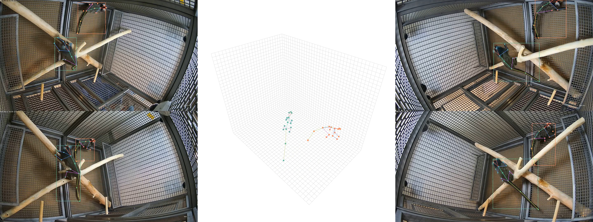

# MarmoPose

Welcome to MarmoPose, a comprehensive multi-marmoset real-time 3D pose tracking system.  

<div align="center">
  
</div>


## Installation

Currently MarmoPose works on Windows and Linux. You can follow these steps for the preparation

**Step 0.** Download and install Miniconda from the [official website](https://docs.conda.io/en/latest/miniconda.html).

**Step 1.** Create a conda environment and activate it.

```shell
conda create --name marmopose python=3.8
conda activate marmopose
```

**Step 2.** Install PyTorch following [official instructions](https://pytorch.org/get-started/locally/). Here is the recommended method.

```shell
conda install pytorch==2.1.2 torchvision==0.16.2 torchaudio==2.1.2 pytorch-cuda=12.1 -c pytorch -c nvidia
```

**Step 3.** Install [MMEngine](https://github.com/open-mmlab/mmengine), [MMCV](https://github.com/open-mmlab/mmcv/tree/2.x), [MMDetection](https://github.com/open-mmlab/mmdetection) and [MMPose](https://github.com/open-mmlab/mmpose/tree/main) using [MIM](https://github.com/open-mmlab/mim).

```shell
pip install -U openmim
mim install mmengine
mim install "mmcv>=2.0.1"
mim install "mmdet>=3.1.0"
mim install "mmpose>=1.1.0"
pip install mmdeploy==1.3.1
pip install mmdeploy-runtime-gpu==1.3.1
```

**Step 4.** Install other dependencies

```shell
pip install --upgrade Pillow h5py seaborn scikit-video mayavi vtk==9.2.6
```

**Step 5.** If you would like to run TensorRT deployed model, refer to [MMDeploy](https://mmdeploy.readthedocs.io/en/latest/get_started.html).


## Usage

**Step 1.** Download models and demos from [MarmoPose1.0](https://cloud.tsinghua.edu.cn/d/c9c1425288a643ee814c/), and place them in the same directory as `run.py`. Alternatively, store them in another directory and specify it in the config file.

**Step 2.** Prepare aligned calibration videos, run calibration.

**Step 3.** Prepare aligned videos for analysis, run prediction, triangulation and visualization (if necessary). Refer to code and comments in the `run.py`.